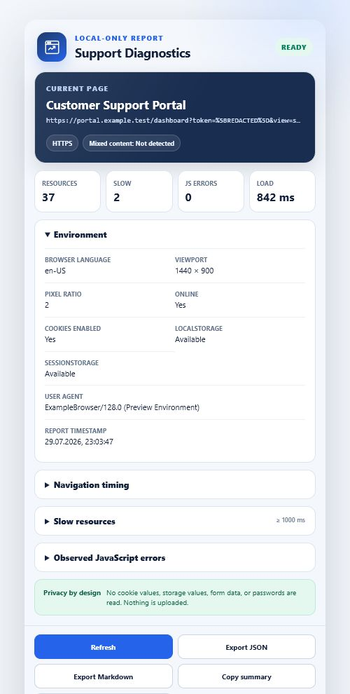
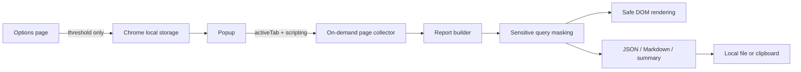
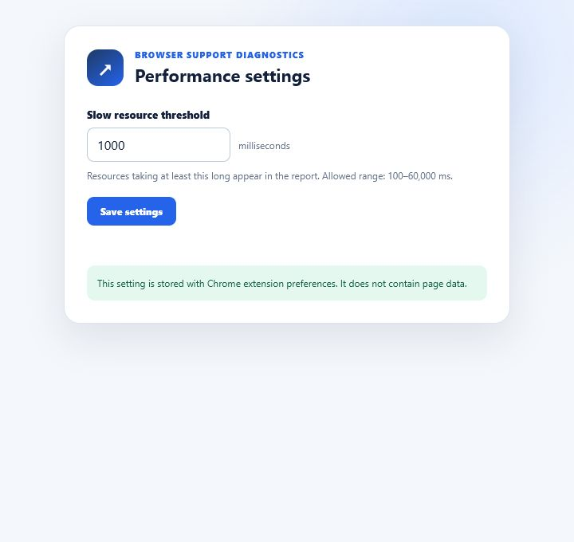

# Browser Support Diagnostics

[](https://github.com/German4341374/browser-support-diagnostics/actions/workflows/ci.yml)
[](manifest.json)
[](LICENSE)

A compact Chrome extension that helps users and support engineers collect a
safe diagnostic snapshot of the active web page. Processing happens locally:
the extension has no analytics, server, remote scripts, or network requests.



## Purpose

Support conversations often begin with environment, loading, and browser-state
questions. Browser Support Diagnostics puts those facts into a consistent JSON
or Markdown report without asking the user to copy data from developer tools.

The report includes:

- masked page URL, title, protocol, and report timestamp;
- user agent, browser language, viewport, pixel ratio, and online state;
- cookie support and local/session storage availability without reading values;
- Navigation Timing metrics and total resource count;
- resources slower than a configurable threshold;
- mixed-content risk based on HTTP resources loaded by an HTTPS page;
- JavaScript errors observed after the collector is activated.

## Privacy model

The extension never reads cookie values, storage values, form contents,
passwords, response bodies, or browsing history outside the active tab. It
does not perform network requests or analytics.

Storage availability is tested with a unique empty marker that is removed
immediately. Query parameter values are masked when their names contain the
segments `token`, `key`, `password`, or `secret`.

Reports exist only in popup memory until the user selects Export JSON, Export
Markdown, or Copy summary. The full model is documented in
[PRIVACY.md](PRIVACY.md).

## Permissions

| Permission | Why it is required |
| --- | --- |
| `activeTab` | Temporarily allows diagnostics for the tab where the user opened the popup |
| `scripting` | Runs the self-contained collector after that user gesture |
| `storage` | Stores only the slow-resource threshold in local extension storage |

There are no host permissions, static all-site content scripts, background
service workers, or remote code.

## Architecture



The collector lives in a separate ES module, but is injected programmatically
instead of being registered for every website. The popup does not use
`innerHTML` for page-controlled data. See [docs/architecture.md](docs/architecture.md)
for component and threat-model details.

## Installation as an unpacked extension

Prerequisites:

- Node.js 24 or newer;
- npm;
- a Chromium-based browser supporting Manifest V3.

Build the extension:

```bash
git clone https://github.com/German4341374/browser-support-diagnostics.git
cd browser-support-diagnostics
npm ci
npm run build
```

Then:

1. Open `chrome://extensions`.
2. Enable **Developer mode**.
3. Select **Load unpacked**.
4. Choose the generated `dist` directory.
5. Open any HTTP or HTTPS page and select the extension icon.

Chrome internal pages, the extension store, local files, and other protected
schemes cannot be inspected.

## Usage

1. Open the target page.
2. Open Browser Support Diagnostics. The first report is collected immediately.
3. Select **Refresh** after reproducing an error.
4. Export JSON or Markdown, or copy the compact summary.
5. Review the output before sharing it.
6. Select **Clear report** to discard the popup report and observed error list.

Open the extension options to change the slow-resource threshold from the
default 1,000 milliseconds.



## Development commands

```bash
npm ci                 # install exactly locked dependencies
npm run lint           # ESLint
npm test               # Vitest unit tests
npm run test:coverage  # tests with coverage thresholds
npm run privacy        # permissions and source privacy checks
npm run build          # create the unpacked extension in dist/
npm run check          # run every required check
```

Equivalent common commands are available through the `Makefile`.

## Project structure

```text
assets/                  Original SVG icon
src/
  content/               On-demand page diagnostics collector
  lib/                   Masking, report, export, settings, and Chrome API modules
  options/               Threshold settings page
  popup/                 Popup UI and controller
scripts/                 Reproducible icon, privacy, and build scripts
tests/                   Vitest unit tests
docs/                    Architecture and development documentation
```

## Testing

The test suite covers sensitive URL masking, malformed input, report formatting,
Markdown and JSON exports, Chrome API failures, and settings boundaries.

GitHub Actions runs on pushes and pull requests with read-only repository
permissions. It installs the lockfile, audits dependencies, runs all checks, and
uploads the unpacked extension as a short-lived workflow artifact.

## Limitations

- Errors that occurred before the collector was activated are unavailable.
- Browser cross-origin protections can hide transfer sizes and some timing data.
- Service worker errors from the inspected site are not captured.
- Mixed-content reporting is an indication based on visible resource timing
  entries, not a complete security audit.
- Page titles and URL paths may contain business-sensitive text and should be
  reviewed before sharing an export.
- The project is distributed as an unpacked development extension and is not
  published in a browser store.

## Security

Review [SECURITY.md](SECURITY.md) before reporting vulnerabilities. Contributions
must preserve local-only processing, minimal permissions, CSP restrictions, and
safe DOM rendering.

## License

Licensed under the [MIT License](LICENSE).
