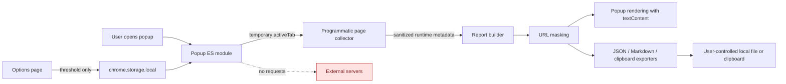

# Architecture

## Design goal

The extension should answer common first-line support questions while keeping
the inspected page's data on the user's device. Permission scope and report
contents are treated as product features, not afterthoughts.

## Data flow

## Components

### Popup

The popup coordinates collection, builds a normalized report, and renders all
page-controlled strings through DOM `textContent`. Exports are generated
in-memory and downloaded through a temporary object URL.

### Programmatic content collector

The collector is an exported, self-contained function passed to
`chrome.scripting.executeScript`. Chrome serializes it into the active page's
main world only after the popup user gesture. It reads browser APIs and
performance metadata, not page form or response contents.

The collector installs bounded error listeners on first activation. This allows
future runtime errors to appear after Refresh without persistent all-site
permissions. Historic errors from before activation cannot be recovered.

### Report builder and masking

The report builder converts untrusted values into a stable schema, bounds
numeric values, trims error text, and applies query-parameter masking to the
page URL, resource URLs, and error source URLs.

### Options

The options page stores one integer: the slow resource threshold. Local
extension storage never receives diagnostic report data.

## Threat considerations

| Threat | Control |
| --- | --- |
| Silent collection across browsing sessions | No host permissions or static content scripts |
| Sensitive query values in exports | Case-insensitive masking for token, key, password, and secret name segments |
| DOM injection through titles or errors | `textContent` rendering and Twig-free static templates |
| Report exfiltration | No network primitives, analytics, background worker, or remote scripts |
| Excessive page modification | One temporary storage marker, removed immediately; one bounded error collector |
| Oversized error/resource data | 25 errors, 50 slow resources, and 300 characters per error |

## Why there is no service worker

The popup directly performs every required action. A background service worker
would add lifecycle and messaging complexity without providing a capability the
extension needs.
